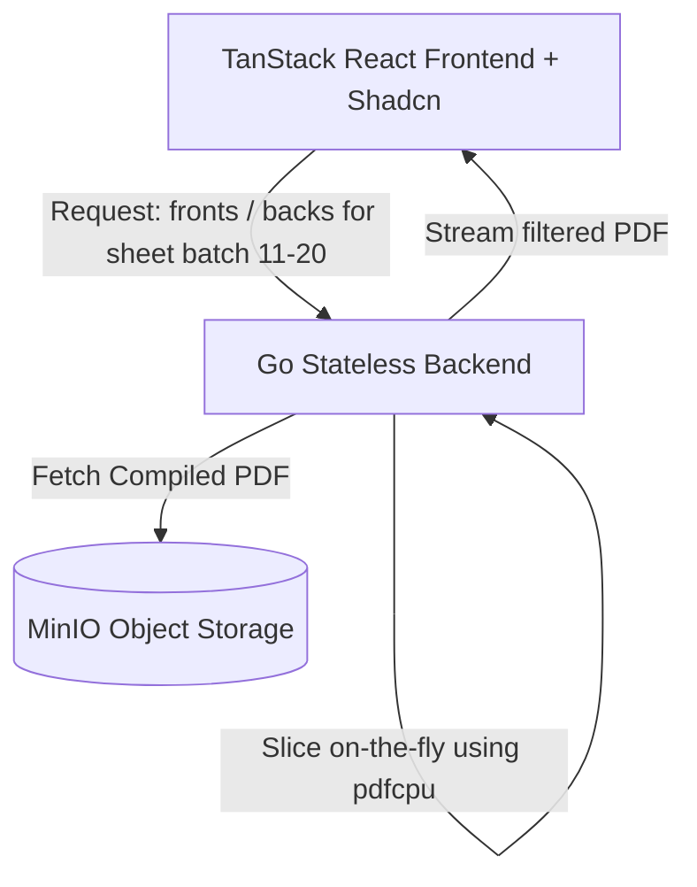

# PDF Booklet Maker & Semantic Search - Implementation Plan

We will build a full-stack, containerizable, SRE-friendly application that allows users to upload PDF documents, splits them into single-page PDFs, extracts text for semantic search (using pg_vector and Ollama), and implements a fully customizable booklet compiler. 

Additionally, we will build a **Printing Helper & Recovery Wizard** to solve common duplex printing issues (jams, double-feeds, skips) and support **Batch Printing** (e.g. printing in groups of 10 or 20 sheets) to minimize paper waste.

---

## Proposed Architecture



### 1. Database Schema (`PostgreSQL` + `pg_vector`)
We will create a database schema with three primary tables:
- `users`: Stores user accounts authenticated via OIDC.
- `documents`: Stores PDF document metadata, page count, and processing status.
- `document_pages`: Stores individual page details:
  - `page_number` (int)
  - `text_content` (text)
  - `embedding` (vector(384) for `all-minilm` or vector(768) for `nomic-embed-text`)
  - `storage_path` (MinIO path to the single-page PDF)
  - `width` (float)
  - `height` (float)
- `compiled_booklets`: Stores compiled booklet records, parameters (margin, gutter, paper_size, signature_size), status, and storage path to the final booklet in MinIO.

```sql
CREATE EXTENSION IF NOT EXISTS vector;
CREATE INDEX ON document_pages USING hnsw (embedding vector_cosine_ops);
```

### 2. API Endpoints (Separation of Concerns)

#### **Document Management**
- `POST /api/documents` - Upload and process PDF (split to pages, extract text, embed).
- `GET /api/documents` - List documents.
- `GET /api/documents/{id}` - Document details and page layout metadata.

#### **Booklet Compilation & Printing Helper**
- `POST /api/documents/{id}/booklet/compile` - Compiles custom booklet.
- `GET /api/booklets/{id}` - Compile status.
- `GET /api/booklets/{id}/download` - Download compiled booklet. Supports query params:
  - **`filter=fronts`**: Returns only odd pages (1, 3, 5...) of the booklet.
  - **`filter=backs`**: Returns only even pages (2, 4, 6...) of the booklet.
  - **`sheets=StartSheet-EndSheet`** (e.g., `sheets=11-20`): Returns booklet pages corresponding to the specified sheets (i.e. booklet pages 21-40).
  - Can be combined: `filter=fronts&sheets=11-20` returns only the fronts of sheets 11-20.

#### **Semantic Search**
- `GET /api/search?q={query}&document_id={optional_doc_id}` - Vector search.

---

## Proposed Changes

### Configuration
- `docker-compose.yml`: Postgres (pgvector), MinIO, Ollama, Prometheus, Grafana, Go backend, and Vite frontend.
- `.agents/AGENTS.md`: Project rules enforcing `shadcn-doctor` and the booklet printing flow.

### Backend Components (Go)
- `pdf.go`: Page splitting, text extraction, custom booklet canvas layout compiler, and on-the-fly booklet page filtering/slicing.
- `handlers.go`: Booklet download endpoint with filtering.

### Frontend Components (React)
- `PrintHelper.tsx`: Manual duplex UI, batching selector, checklist, and recovery reprint wizard.

---

## Verification Plan

### Automated Tests
Run unit tests for page filtering math and sheet-to-page calculations:
```bash
go test ./backend/...
```

Verify styling health and component compliance:
```bash
npm run shadcn-check
```

### Manual Verification
1. Spin up application.
2. Upload a 40-page PDF.
3. Compile booklet (10 sheets total).
4. Go to **Printing Helper**:
   - Set Batch Size to 5 sheets.
   - Batch 1 (Sheets 1–5):
     - Download Fronts: Verify it contains booklet pages 1, 3, 5, 7, 9.
     - Download Backs: Verify it contains booklet pages 2, 4, 6, 8, 10.
   - Batch 2 (Sheets 6–10):
     - Download Fronts: Verify it contains booklet pages 11, 13, 15, 17, 19.
     - Download Backs: Verify it contains booklet pages 12, 14, 16, 18, 20.
5. In **Recovery Console**, input "Ruined Sheet: 7".
   - Download Reprint Fronts: Verify it contains page 13 (Sheet 7 Front).
   - Download Reprint Backs: Verify it contains page 14 (Sheet 7 Back).
